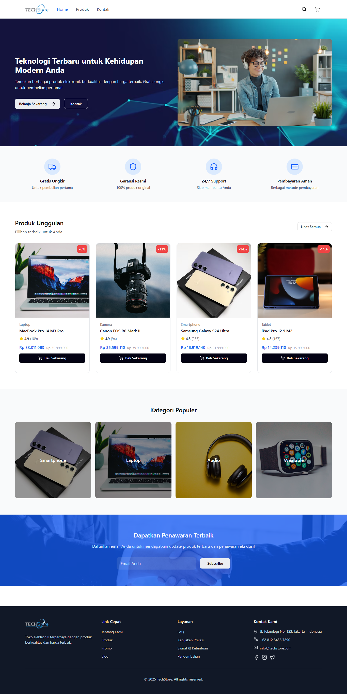
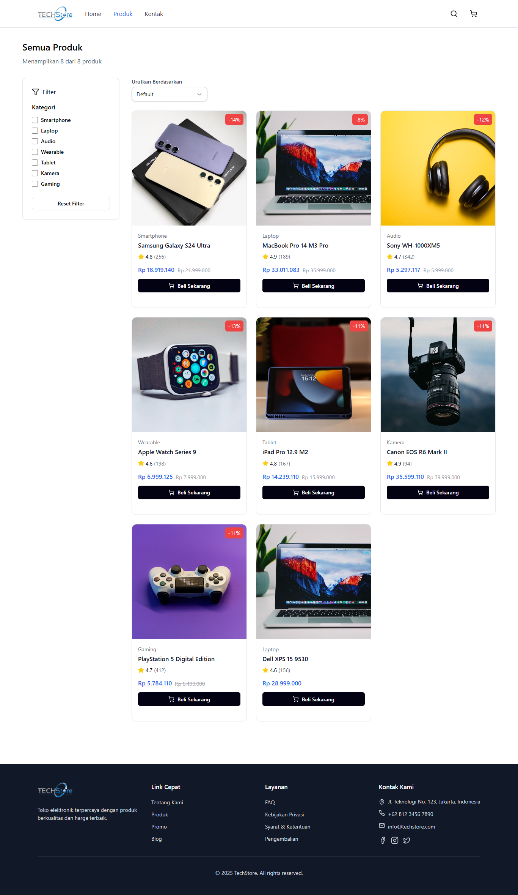
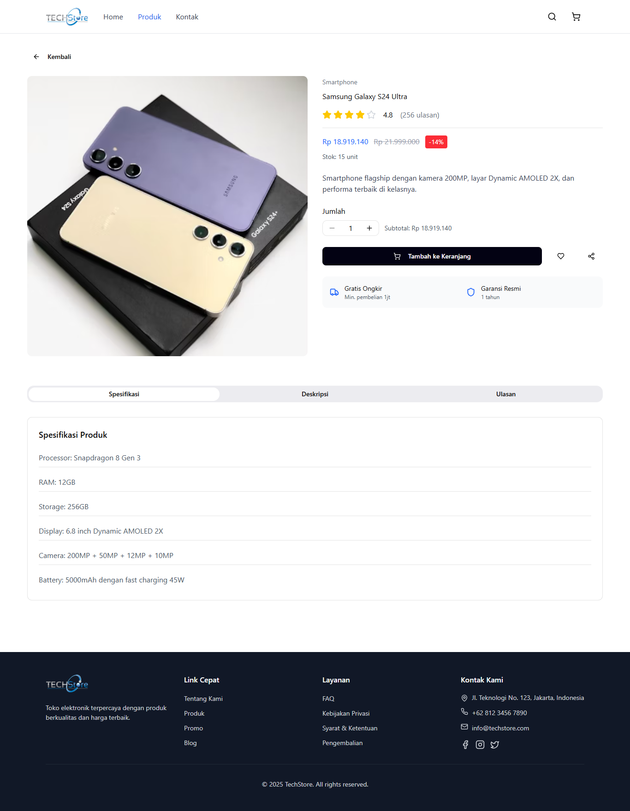
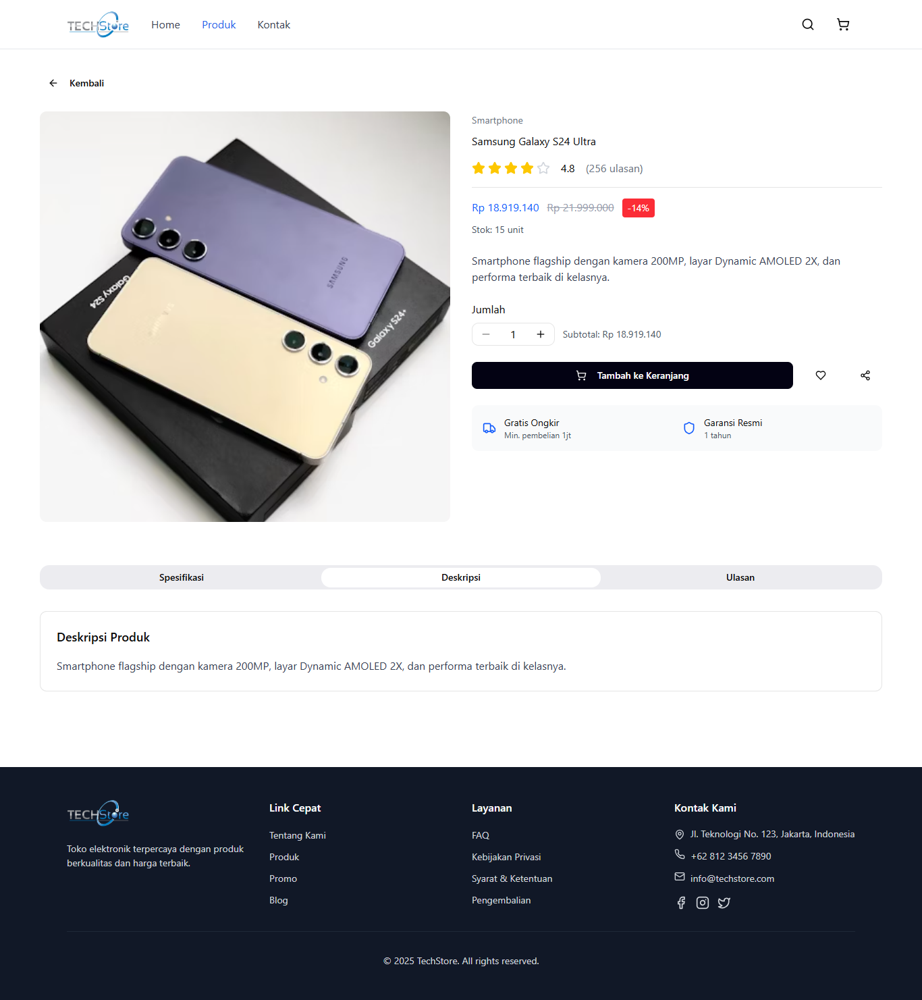
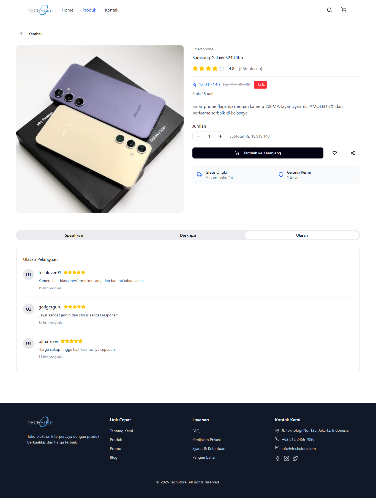
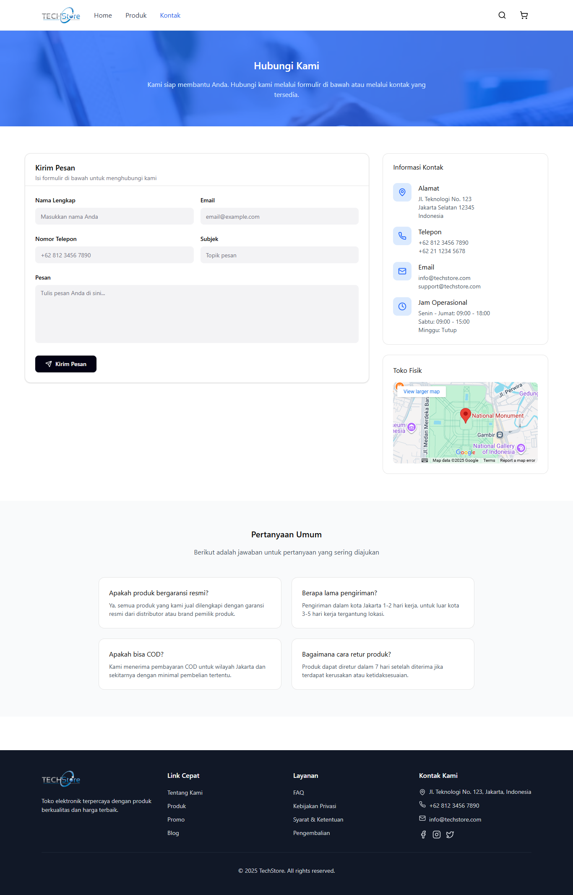

# 🛒 TechStore

## 📄 Deskripsi Singkat

TechStore adalah website toko elektronik modern yang menampilkan berbagai produk teknologi seperti smartphone, laptop, dan aksesori digital. Website ini dirancang dengan tampilan responsif dan interaktif agar pengguna dapat menjelajahi produk dengan mudah di berbagai perangkat.

TechStore dibangun menggunakan Vite sebagai build tool untuk pengembangan modern berbasis HTML, CSS (Tailwind), dan JavaScript (ES6 Modules). Fokus utama proyek ini adalah pada performa tinggi, struktur modular, dan pengalaman pengguna yang intuitif.

## 🎥 Link Video Presentasi

[Klik di sini untuk menonton](https://youtu.be/pzGGanZoscc?si=ZPxbLKEAkdvuPIvT)

## ⚙️ Cara Menjalankan

### 1. Clone Repository

```sh
git clone https://github.com/mby444/techstore.git
cd techstore
```

### 2. Install Dependencies

Pastikan sudah menginstal Node.js dan npm.
Lalu jalankan:

```sh
npm install
```

### 3. Jalankan Server Development

Gunakan perintah berikut untuk menjalankan proyek melalui Vite:

```sh
npm run dev
```

### 4. Akses di Browser

Setelah server berjalan, buka URL yang ditampilkan di terminal:

```sh
http://localhost:3000/
```

## 🌐 Halaman

### 1. Home



### 2. Produk



### 3. Detail Produk

- Menampilkan spesifikasi
  

- Menampilkan deskripsi
  

- Menampilkan ulasan
  

### 4. Kontak


